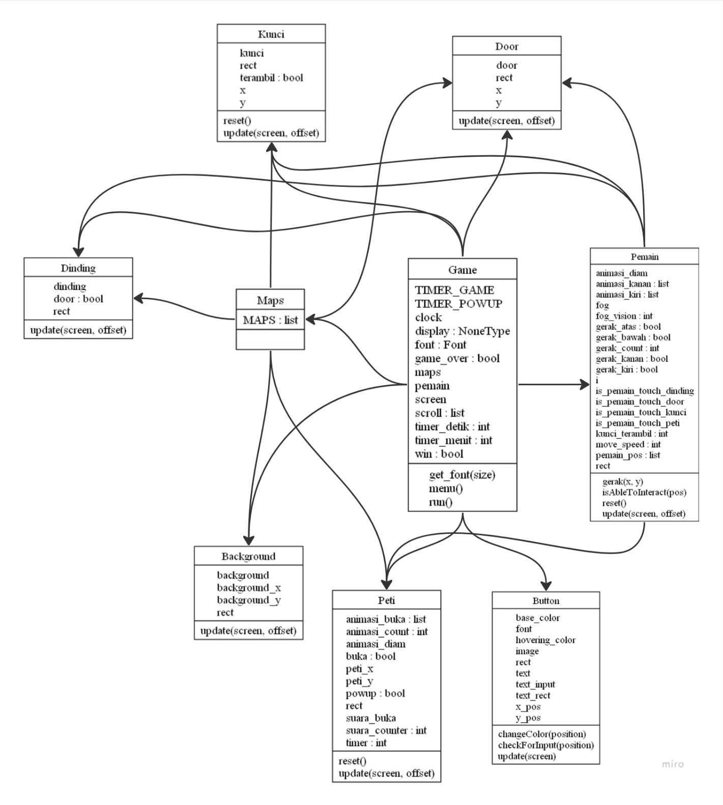

# Maze Rusher

- [Background Story](#background-story)
- [Tema Game](#tema-game)
- [Library](#library)
- [Desain UML](#desain-uml)
- [Kontributor](#kontributor)

# Tema Game
Adventure
- Pemain akan berpetualang menjelajahi labirin yang luas dan
penuh misteri, mencari jalan keluar yang tersembunyi.

Timer
- Pemain harus bergerak cepat dan cerdik untuk menemukan 3
kunci dalam waktu 5 menit sebelum pintu labirin tertutup
selamanya.

Labirin
- Suasana mencekam dan ancaman bahaya mengintai di setiap
langkah, membuat pemain merasa tegang dan waspada

## Background Story

Seorang gadis bernama Yakui nekat mencari obat
penyembuh untuk ibunya yang sedang sakit keras.
Sampai sekarang tidak ada yang bisa
menyembuhkannya. Ada rumor yang mengatakan
“Ada sebuah obat yang bisa menyembuhkan segala
penyakit di dalam labirin”. Tanpa basa basi, gadis
itu segera memasuki labirint tersebut. Namun dia
tidak tahu tantangan di dalamnya. Setelah sampai
di dalam, bukannya menemukan obat yang dicari, ia
malah terjebak di labirin. Apakah dia bisa berhasil
keluar dengan selamat?

## Library

Library : 
- Pygame
- Random
- Sys

## Cara Bermain
- Pemain (X) memasuki labirin yang gelap dan mencekam untuk mencari obat penyembuh.
- Pemain harus bergegas menemukan 3 kunci yang tersembunyi di dalam labirin
- Setelah mendapatkan 3 kunci, pemain harus segera menemukan dan membuka pintu keluar labirin sebelum waktu habis.

## Desain UML

## Kontributor

- Alma Julio Isnansyah (122140057) - Programmer
- Muhammad Narendra Budi Utomo (122140050) - Programmer
- Kiagus M Roihan (122140073) - Map Designer
- Pricelia Putri Zulkarnain (122140075) - Pembuat Laporan
- Felix Ferdinandus Martua Pasaribu (122140070) - Pembuat Laporan
- Naufal Saqib Athaya (122140072) - Pembuat Asset
