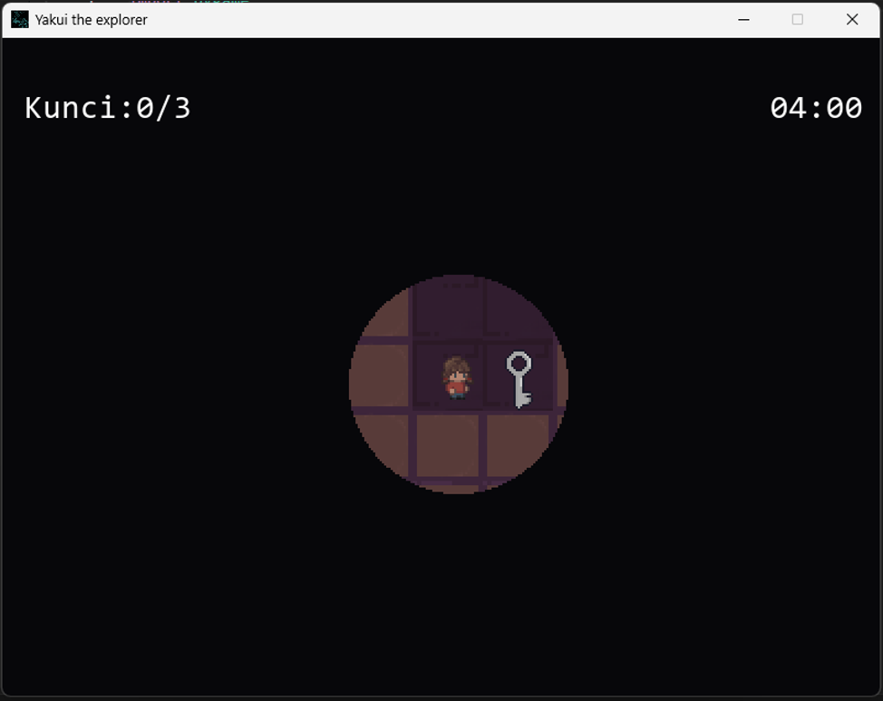

# **Yakui The Explorer**

## Daftar Isi
- [Background Story](#background-story)
- [Karakteristik & Tema Game](#karakteristik--tema-game)
- [Library](#library)
- [Cara Bermain](#cara-bermain)
- [Desain UML](#desain-uml)
- [Kontributor](#kontributor)

## Background Story

Seorang gadis bernama Yakui nekat mencari obat penyembuh untuk ibunya yang sedang sakit keras. Sampai sekarang, tidak ada yang bisa menyembuhkannya. Ada rumor yang mengatakan, "Ada sebuah obat yang bisa menyembuhkan segala penyakit di dalam labirin." Tanpa basa-basi, Yakui segera memasuki labirin tersebut. Namun, dia tidak tahu tantangan apa yang menantinya di dalam. Setelah sampai di dalam, bukannya menemukan obat yang dicari, ia malah terjebak di labirin. Apakah dia bisa berhasil keluar dengan selamat?

## Karakteristik & Tema Game

**Adventure**
- Pemain akan berpetualang menjelajahi labirin yang luas dan penuh misteri, mencari jalan keluar yang tersembunyi.

**Timer**
- Pemain harus bergerak cepat dan cerdik untuk menemukan 3 kunci dalam waktu 5 menit sebelum pintu labirin tertutup selamanya.

## Library

Proyek ini menggunakan beberapa library sebagai berikut:
- Pygame

Mengelola grafis 2D, penanganan input dari pengguna, serta memainkan suara dan musik. 
- Random

Menyediakan fungsi-fungsi untuk menghasilkan angka acak atau memilih elemen secara acak
- Sys

Memungkinkan untuk berinteraksi dengan sistem

## Cara Bermain

1. Tampilan awal game jika dibuka

2. Pemain menjelajahi labirin untuk menemukan 3 kunci yang ada

3. Ada peti yang berisi buff (Bergerak Cepat atau fognya membesar) & debuff (Bergerak lambat atau fognya mengecil)

4. Jika sudah menemukan 3 kunci yang ada, pemain dapat menyelesaikan game melalui pintu yang tersedia
- Jika pemain mencoba membuka pintu dengan kunci < 3

- Jika pemain mencoba membuka pintu dengan kunci = 3

## Desain UML

## Kontributor

- **Alma Julio Isnansyah (122140057)** - Programmer
- **Muhammad Narendra Budi Utomo (122140050)** - Programmer
- **Kiagus M Roihan (122140073)** - Map Designer
- **Pricelia Putri Zulkarnain (122140075)** - Pembuat Laporan
- **Felix Ferdinandus Martua Pasaribu (122140070)** - Pembuat Laporan
- **Naufal Saqib Athaya (122140072)** - Pembuat Asset
